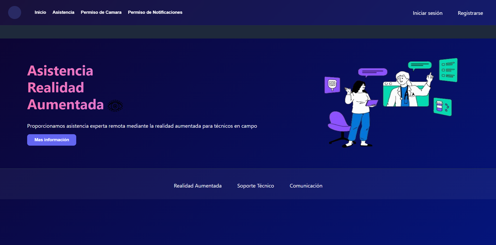
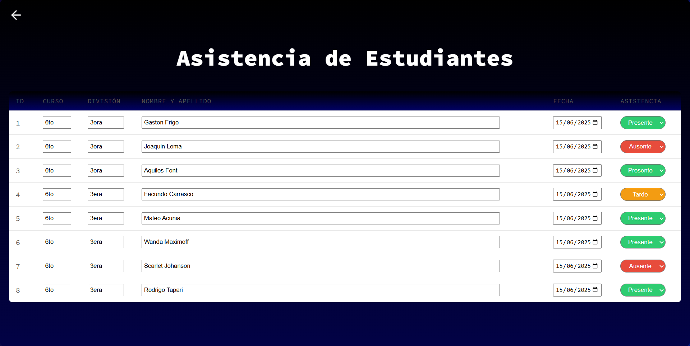
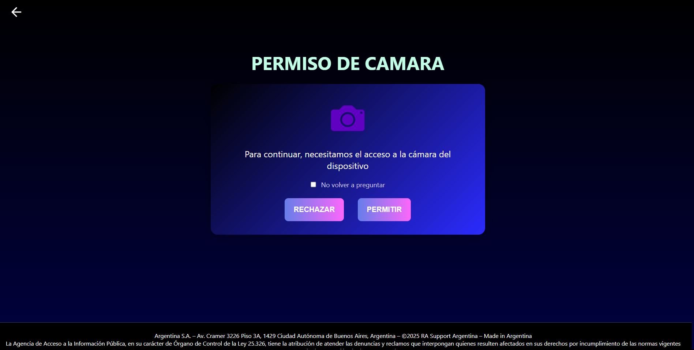
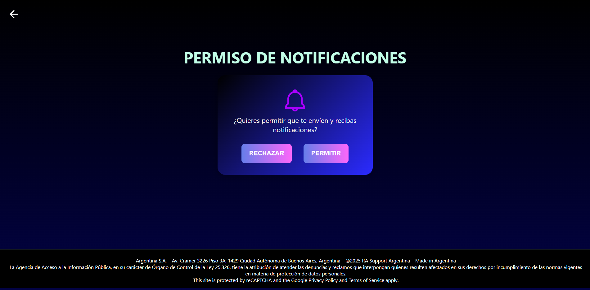
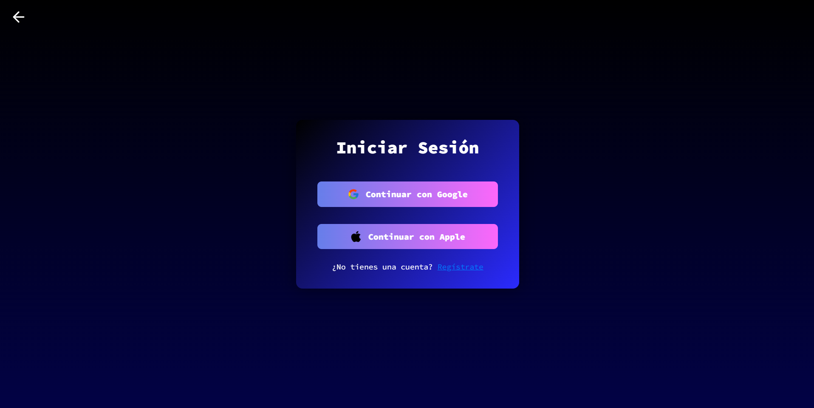
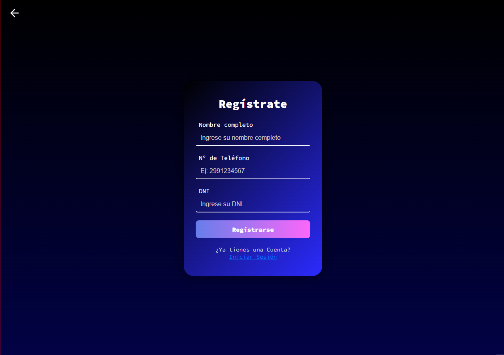
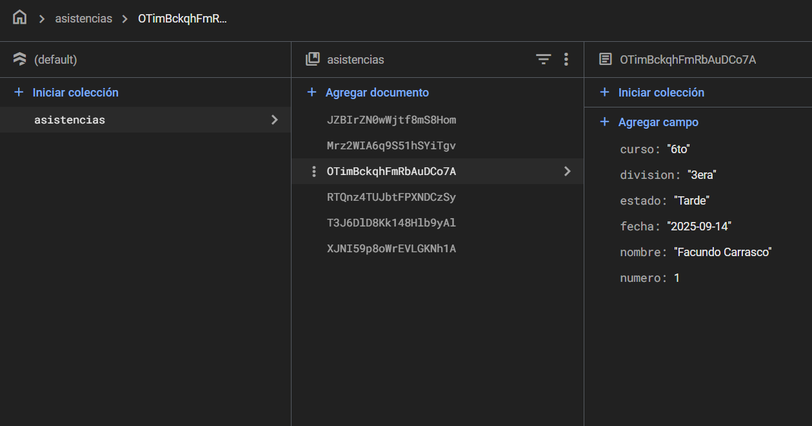

# Proyecto-APRA 

## 🖥️🔧'Asistencia Por Realidad Aumentada'
## 👥 Nombre del grupo e integrantes
**Grupo:** R.A.Support 📖 
**Integrantes:**
- *Aquiles Font*
- *Facundo Carrasco*
- *Gastón Frigo*
- *Lema Joaquin*
- *Mateo Acuña*

## Roles definidos:
- **Frontend:**
- *Lema Joaquin*
- *Carrasco Facundo*
- **Backend:**
- *Acuña Mateo*
- **Diseño:**
- *Font Aquiles*
- **Documentacion:**
- *Frigo Gaston*

## 📤 Nombre y objetivo de la App:
**Nombre de la App:** Asistencia RA
**Objetivo:**
El objetivo de la App es brindar a los docentes una herramienta moderna para registrar la asistencia de alumnos en tiempo real mediante la cámara del dispositivo, utilizando elementos de realidad aumentada como etiquetas flotantes (c/Nombre, Apellido, Ingreso...), confirmaciones visuales o notificaciones.

## Herramientas utilizadas:
- **GitHub:** Como respositorio..
- **Canva:** Como modelado y prototipado.

## Estructura:
- **Pantalla Login:** Para que el docente pueda iniciar sesión.
- **Pantalla Registrarse:** Para que el docente cree una cuenta.
- **Pantalla Inicio:** Para que la página sea intuitiva y comprensible para el docente.
- **Pantalla Datos de Asistencia:** Para que se tengan los datos e información de los Alumnos.
- **Pantalla permiso de Cámara:** Pantalla del permiso de la cámara.
- **Pantalla Permiso de Notificaciones:** Pantalla para dar permisos de notificación.
- **Pantalla Asistencia por Cámara:** Pantalla para la asistencia por cámara.

## Diseño y Estilo:
**Pantallas Principales:**
- Login (Inicio de sesión)
- Registrarse
- Inicio
- Datos de Asistencia
- Permiso para Camara
- Permiso de Notificaciones
- Asistencia por Cámara
- **Diseño:** 
- "Colores azules, oscuros y claros:" Se utiliza un degrade Azul y el Blanco. 
- "Iconos legibles:" Se encuentra íconos intuitivos y claros.
- "Tipografía:" Se utiliza la tipografía 'Code-Pro', siendo más legible.
- "Menor sobrecarga de información:" Se aplicó una interfaz e inicio más amigable.
## Explicación:
"Se utilizaron colores sencillos, oscuros, pero eficientes a la hora de llamar la atención del Usuario como también su tipografía, y a su vez, se utilizó un diseño igual de atractivo y amigable..."

## Vistas/Capturas de la página:
- **Página Inicio:**

- **Tabla de Asistencia:**

- **Permisos de Cámara:**

- **Permisos de Notificaciones:**

- **Inicio Sesión:**

- **Registrarse:**

## Capturas de la consola de firebase:
- **Colección Asistencia:**

- **Coleccion Usuario:**
